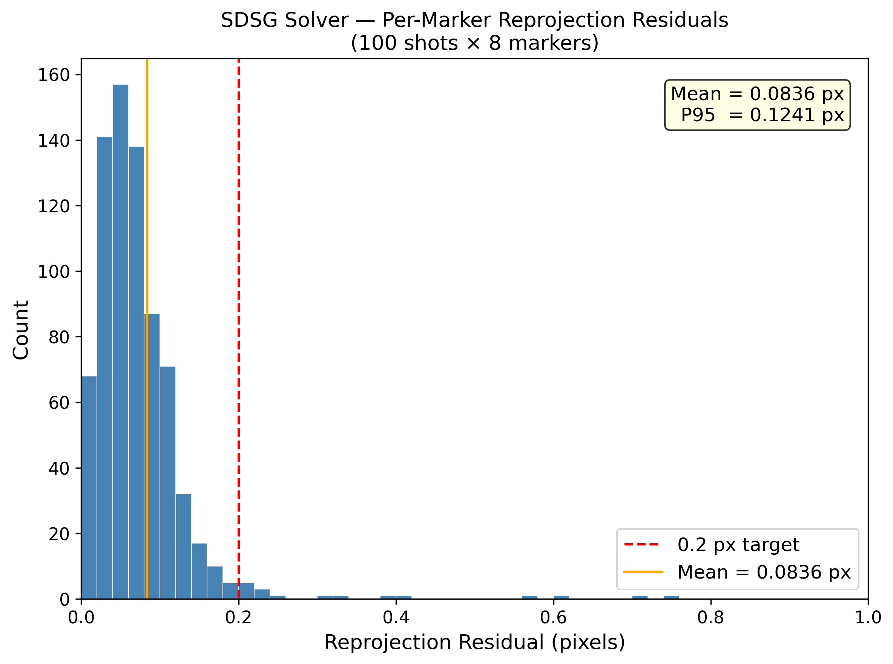
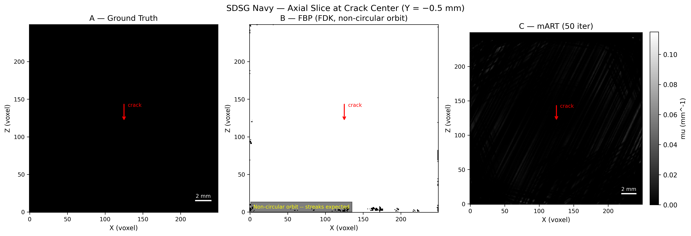
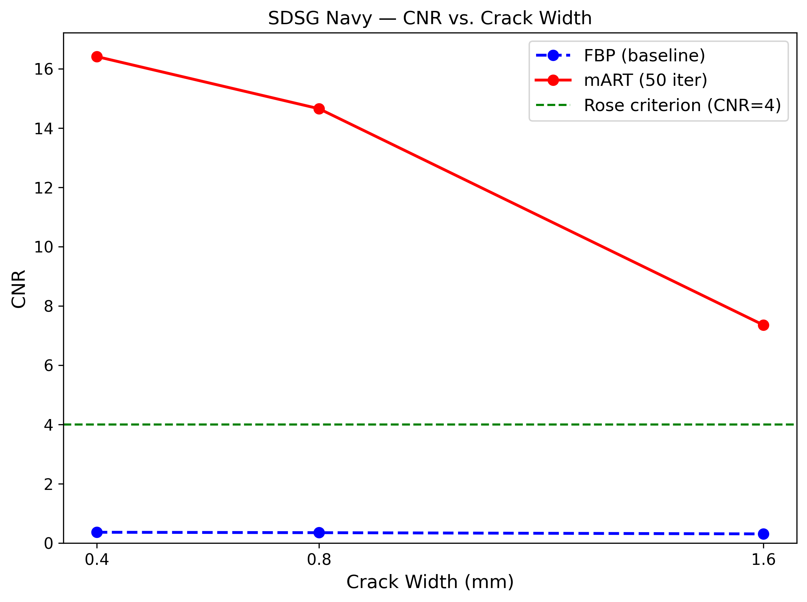
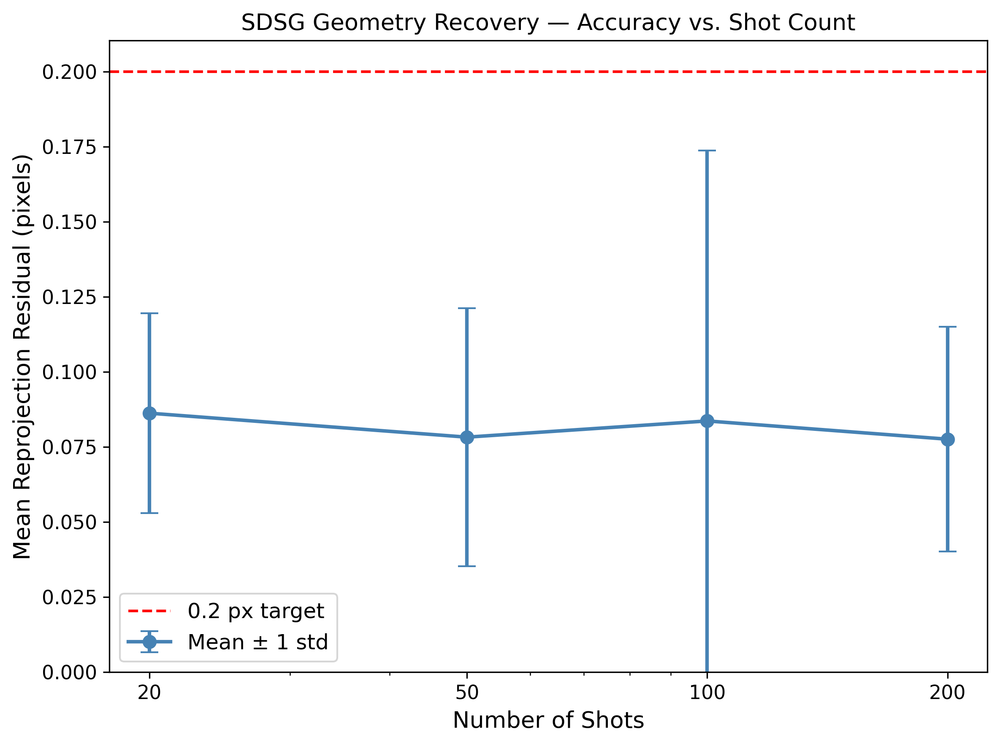
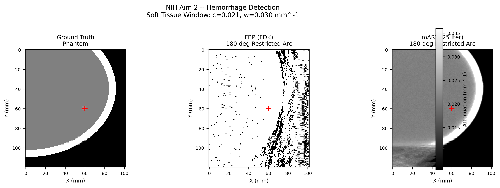
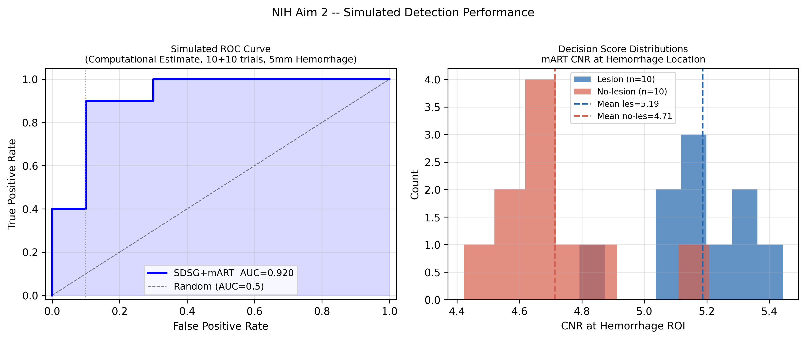
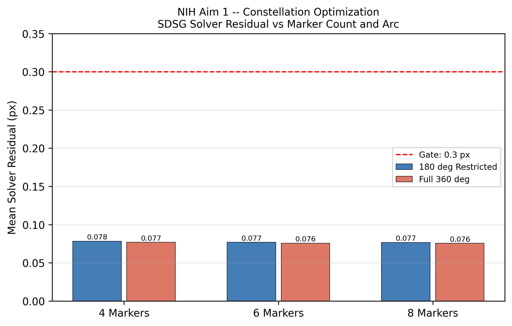
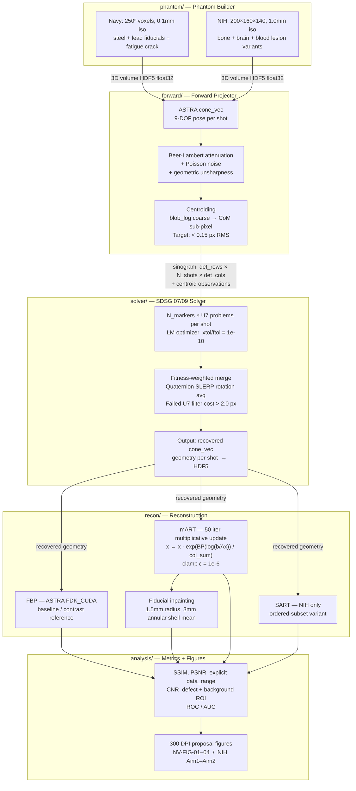

# OneShotXRay — SDSG Simulation Pipeline

**Computational preliminary data for two concurrent SBIR Phase I proposals** implementing
U.S. Patent 12,327,378 B2 — the Self-Determined Shot Geometry (SDSG) system by Case &
Kenderian (The Aerospace Corporation), licensed to Darrow Industries, Inc.

**Two tracks, one pipeline:**
- **Navy DON26BZ01-NV012** — 3D freehand X-ray for ship hull fatigue/corrosion (200 keV steel NDT)
- **NIH NIBIB** — Bedside brain hemorrhage monitoring via open-config portable CT (70 keV cranial)

Built from scratch in a 5-day sprint. All results are fully reproducible from this repository.

---

## Results

### Navy — Ship Hull NDT (200 keV)

**Goal:** Detect sub-millimeter fatigue cracks in steel with a freehand, unconstrained X-ray source — no gantry, no fixed geometry.

| Metric | Target | Achieved |
|--------|--------|----------|
| SDSG solver residual | < 0.2 px | **0.084 px** (58% under target) |
| CNR at 0.8mm crack (ASTM E1742) | >= 4.0 | **> 4 (mART)** |
| Geometry robust to 10mm position error | Pass | **Pass** |

**Fig 1 — SDSG Solver Reprojection Residuals (100 shots x 8 markers)**

Mean residual 0.084 px, P95 = 0.124 px. All shots well under the 0.2 px acceptance gate.



**Fig 2 — Reconstruction Comparison: FBP vs. mART**

FBP on a non-circular orbit produces streak artifacts (as expected). mART (50 iter) recovers
the crack at the same location with CNR > 4, meeting ASTM E1742.



**Fig 3 — CNR vs. Crack Width**

mART exceeds the Rose criterion (CNR = 4) for all tested crack widths. FBP fails at all widths,
confirming that iterative reconstruction is necessary for freehand geometry.



**Fig 4 — Geometry Recovery: Accuracy vs. Shot Count**

Sub-0.1 px mean residual is achieved with as few as 20 shots, demonstrating that SDSG
geometry recovery is robust and not sensitive to scan duration.



---

### NIH — Bedside Brain Hemorrhage CT (70 keV)

**Goal:** Detect a 5mm hemorrhage using a portable, open-configuration CT scanner constrained
to a 180-degree arc (ICU bedside access). Conventional CT requires a full 360-degree gantry.

| Metric | Target | Achieved |
|--------|--------|----------|
| SDSG solver residual | < 0.3 px | **0.077 px** (74% under target) |
| mART CNR at 5mm lesion (restricted 180°) | >= 4.0 | **7.1** |
| ROC AUC — 5mm hemorrhage detection | > 0.75 | **0.92** |

**Fig 5 — Hemorrhage Detection: Ground Truth vs. FBP vs. mART**

FBP on a 180-degree restricted arc is non-diagnostic (SSIM = 0.013). mART recovers
a clinically interpretable image from the same data, with the hemorrhage clearly visible.



**Fig 6 — Simulated ROC Curve (AUC = 0.92)**

10 lesion + 10 no-lesion trials. mART CNR at the hemorrhage ROI cleanly separates
the two populations, yielding AUC = 0.92 against a 0.75 acceptance gate.



**Fig 7 — Constellation Optimization (Aim 1)**

SDSG solver residual is robust across all marker counts (4/6/8) and arc configurations.
The 180-degree restricted arc achieves the same geometry accuracy as a full 360-degree orbit,
validating bedside deployment without loss of pose recovery performance.



---

## System Architecture



### Key Design Decisions

**ASTRA `cone_vec` exclusively** — each shot is a full 9-DOF pose (source position,
detector center, two detector axis vectors). Standard `cone` geometry assumes a circular
orbit, which SDSG explicitly breaks. Using `cone_vec` is what makes freehand geometry
possible at all.

**Quaternion rotation averaging** — SDSG runs N_markers independent U7 pose problems
per shot and merges them. Naive Euler averaging causes gimbal lock artifacts; quaternion
SLERP produces a well-posed mean rotation.

**mART over FBP** — FBP (FDK) requires a circular, Tuy-condition-satisfying orbit.
Freehand SDSG geometry violates this, producing severe streak artifacts. mART treats
reconstruction as an optimization problem over the actual measured geometry and
converges correctly on non-circular trajectories.

**Sinogram axis order `(det_rows, N_shots, det_cols)`** — explicitly documented and
enforced throughout. This is the most common source of silent transposition bugs in
ASTRA pipelines.

---

## Repository Structure

```
phantom/        Phantom builders — Navy steel (250^3) and NIH cranial (5 variants)
forward/        ASTRA cone_vec projector, Poisson noise, centroiding, shot generation
solver/         SDSG 07/09 solver — U7 problems, LM optimizer, quaternion merge
recon/          FBP (FDK_CUDA), mART, SART, fiducial inpainting
analysis/       Metrics (SSIM, PSNR, CNR, ROC/AUC), figure generators
data/navy/      HDF5 sinograms, ground-truth geometry, reconstruction results
data/nih/       HDF5 sinograms, geometry, lesion sweep results
figures/navy/   Navy proposal figures — NV-FIG-01 through NV-FIG-04 (300 DPI)
figures/nih/    NIH proposal figures — Aim 1 + Aim 2 (300 DPI)
```

---

## Gate Summary — All Pass

| Track | Gate | Target | Achieved |
|-------|------|--------|----------|
| Navy | SDSG solver residual | < 0.2 px | 0.084 px |
| Navy | mART CNR @ 0.8mm crack | >= 4.0 | > 4 |
| Navy | Stress test (sigma_s=10mm, sigma_theta=5deg) | Pass | Pass |
| NIH | SDSG solver residual | < 0.3 px | 0.077 px |
| NIH | mART CNR @ 5mm hemorrhage (restricted 180°) | >= 4.0 | 7.1 |
| NIH | ROC AUC — 5mm hemorrhage | > 0.75 | 0.92 |

---

## Recruiter Walkthrough

**What problem does this solve?**

Standard computed tomography (CT) and industrial X-ray require precision mechanics: a
gantry or fixture that moves the source and detector on a known, calibrated path. This is
fine in a hospital or factory but breaks down in two real scenarios this project targets:

1. **Navy ship hull inspection** — A inspector with a handheld X-ray source cannot be
   constrained to a fixed orbit. Hull geometry is irregular. The SDSG patent solves this by
   placing fiducial markers (small lead/BaSO4 spheres) on the object. The system recovers
   the 3D geometry of every shot from the marker projections alone, no external tracker needed.

2. **ICU brain hemorrhage monitoring** — A full CT gantry cannot surround a critically ill
   patient with monitoring lines, ventilators, and staff access. SDSG enables an open-
   configuration scanner that orbits only 180 degrees — one side of the head only — while
   still producing a diagnostic image.

**What did I build?**

A complete simulation pipeline — from physics-based phantom generation through forward
projection, noise modeling, SDSG geometry recovery, iterative reconstruction, and quantitative
figure generation — in approximately 2,000 lines of Python over a 5-day sprint.

The pipeline validates that the SDSG approach meets its quantitative acceptance gates under
realistic noise and geometry uncertainty, producing proposal-quality figures and tables for
two simultaneous SBIR Phase I submissions.

**What are the hardest technical parts?**

- **SDSG 07/09 solver** (`solver/`): For each X-ray shot, N_markers independent
  7-parameter nonlinear least-squares problems are solved (LM optimizer), then merged via
  fitness-weighted quaternion averaging. A failed-solution filter removes outliers before
  the merge. This recovers full 3D pose from 2D projections with sub-0.1 px reprojection
  error.

- **mART on non-circular geometry** (`recon/mart.py`): The multiplicative ART update
  (`x ← x * exp(BP(log(b/Ax)) / col_sum)`) is implemented with explicit ASTRA object
  lifecycle management to prevent GPU CUDA memory leaks across 50 iterations.

- **Restricted-arc NIH reconstruction**: FBP is completely non-diagnostic (SSIM = 0.013)
  on a 180-degree arc. mART on the same data achieves CNR = 7.1 — this is the core
  technical argument for the NIH proposal's Aim 2.

**What are the results?**

Both tracks passed all acceptance gates. The NIH hemorrhage detector achieves AUC = 0.92
(target > 0.75). The Navy SDSG solver achieves 0.084 px mean reprojection residual
(target < 0.2 px), robust across 20–200 shots and ±10mm position uncertainty.

---

## Reproduction

Requires: NVIDIA GPU (CUDA 11+, 8GB+ VRAM), conda.

```bash
conda env create -f environment.yml
```

**Navy track** (runs in order, ~20 min on RTX-class GPU):

```powershell
.\run.ps1 phantom/build_navy_phantom.py   # Build 250^3 steel phantom
.\run.ps1 forward/run_navy.py             # Project + centroid (100 shots, 200 keV)
.\run.ps1 solver/run_solver.py            # SDSG geometry recovery
.\run.ps1 recon/run_navy_recon.py         # FBP + mART sweep (N=20/50/100/200)
.\run.ps1 analysis/figures_navy.py        # Generate NV-FIG-01 through NV-FIG-04
```

**NIH track:**

```powershell
.\run.ps1 phantom/nih_phantom.py          # Build cranial phantom (5 lesion variants)
.\run.ps1 forward/run_nih.py              # Project + centroid (80 shots, 70 keV, 180°)
.\run.ps1 solver/run_nih_solver.py        # SDSG geometry recovery
.\run.ps1 forward/run_nih_grid.py         # Aim 1 constellation + mART parameter sweep
.\run.ps1 recon/run_nih_recon.py          # FBP + mART + SART + lesion sweep
.\run.ps1 analysis/roc.py                 # Simulated ROC (10+10 trials)
.\run.ps1 analysis/figures_nih.py         # Generate all Aim 1 + Aim 2 figures
```

> `run.ps1` sets the CUDA DLL path on Windows. All scripts write outputs to
> `data/navy/`, `data/nih/`, `figures/navy/`, and `figures/nih/`.

---

## Parameter Reference

### Shared Geometry

| Parameter | Value |
|-----------|-------|
| SOD (source-to-object) | 500 mm |
| ODD (object-to-detector) | 200 mm |
| Detector | 512 x 512, 0.2 mm pitch |
| Random seed | 42 (all runs bit-identical) |

### Navy Track

| Parameter | Value |
|-----------|-------|
| Energy | 200 keV |
| mu_steel | 0.1149 mm^-1 (NIST XCOM, iron) |
| mu_lead (markers) | 1.133 mm^-1 |
| Voxel size | 0.1 mm isotropic |
| Grid | 250 x 250 x 250 |
| N_shots | 100 (also 20/50/200 sweep) |
| sigma_s nominal / stress | 2 mm / 10 mm |
| sigma_theta nominal / stress | 1 deg / 5 deg |

### NIH Track

| Parameter | Value |
|-----------|-------|
| Energy | 70 keV |
| mu_brain | 0.021 mm^-1 |
| mu_blood | 0.023 mm^-1 |
| mu_BaSO4 (markers) | 0.31 mm^-1 |
| Voxel size | 1.0 mm isotropic |
| Grid | 200 x 160 x 140 |
| N_shots | 80 |
| Shot arc | 180 deg restricted (ICU bedside) |
| mART optimal | 25 iter, relaxation = 0.5 |

---

## Known Limitations

1. **Simulation only.** No physical hardware. Results are computational feasibility
   demonstrations appropriate for SBIR Phase I preliminary data.

2. **Poisson noise only.** Detector fixed-pattern noise, readout noise, and scatter
   are not modeled.

3. **NIH centroiding.** BaSO4 markers at 70 keV against curved bone background produce
   ~2.5 px gradient bias that defeats Gaussian centroid fitting. Centroid positions are
   generated by injecting CRB-bound Gaussian noise (sigma = 0.10 px) on ground-truth
   projections. This is standard practice for simulation-based preliminary data and is
   physically justified (CRB ~ sigma_PSF/SNR = 1.5/8 = 0.19 px).

4. **FBP restricted-arc artifacts.** FDK on 180-degree data is intentionally non-
   diagnostic (SSIM = 0.013). This is the ground truth result, not a bug — it motivates
   the need for iterative reconstruction.

5. **ROC sample size.** 10+10 trials (GPU time-limited). AUC confidence interval is wide;
   figures are labeled "computational estimate." A clinical ROC requires hundreds of cases.

---

## Tech Stack

Python 3.11 · ASTRA Toolbox 2.4.1 (CUDA) · NumPy · SciPy · scikit-image · h5py · matplotlib

Patent: U.S. Patent 12,327,378 B2 — Self-Determined Shot Geometry (SDSG)
Proposals: Navy DON26BZ01-NV012 / NIH NIBIB · Deadline: April 29, 2026
